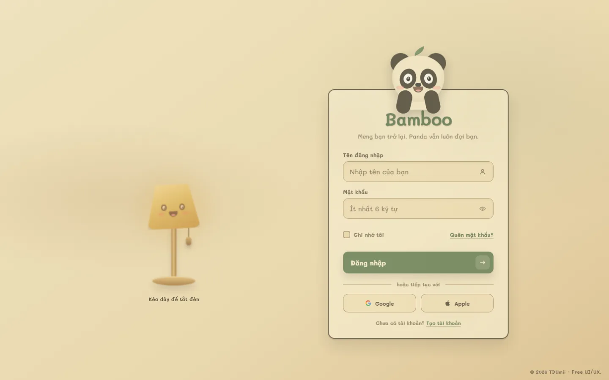
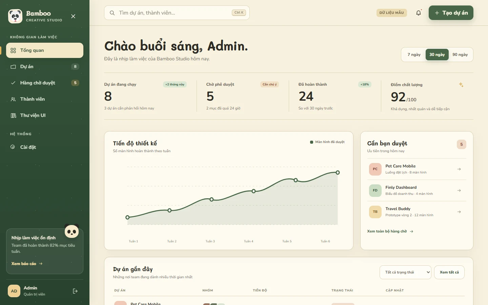
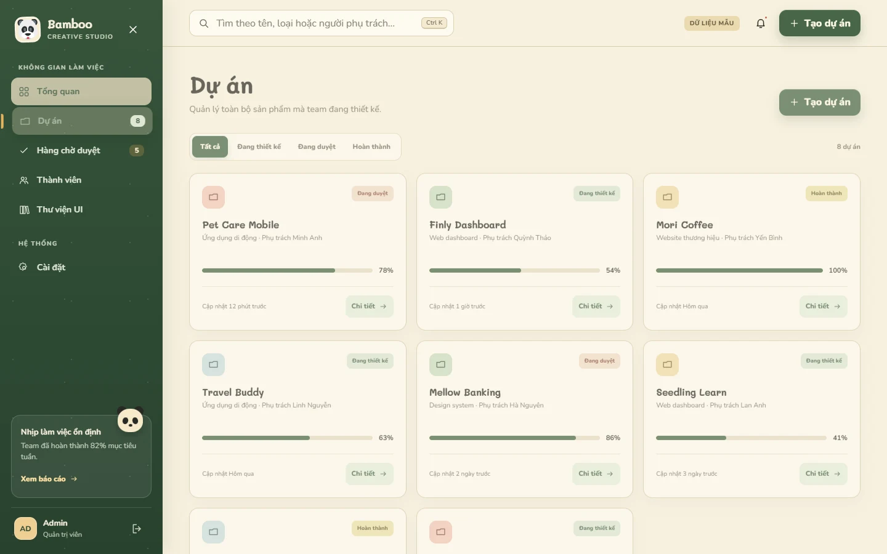

# BamBo Login

A free interactive login and admin dashboard experience with a vintage storybook aesthetic, a cheerful panda, and a pull-cord lamp with spring-like physical feedback.

## Preview

### Interactive login



### Bamboo Studio dashboard



### Interactive project workspace



## Highlights

- Pull the lamp cord down and release it to toggle the light, complete with stretch, recoil, and bounce.
- Turning the lamp off changes the lighting and character expressions while locking the entire form until the light is restored.
- Turning the lamp back on wakes the panda, who waves and says `Hiii!`.
- The panda covers its eyes while a password is entered and peeks when password visibility is enabled.
- Native Edge and Windows password reveal controls are suppressed to prevent a duplicate eye icon.
- Keyboard interaction, reduced-motion preferences, and responsive layouts are supported.
- A responsive Bamboo Studio dashboard includes six deep-linkable workspaces: overview, projects, review queue, members, UI library, and settings.
- Projects can be created, searched, filtered, opened in a detail drawer, edited, progressed, completed, and archived with a two-step confirmation.
- Review decisions update the related project, metrics, sidebar counts, and recent activity in one action.
- Team members can be added, assigned a design role, activated, or paused; UI library components can be filtered, favorited, and copied as tokens.
- Density, notification, and sound-feedback preferences are saved alongside all demo changes in `localStorage`, with a two-step reset control.
- Demo authentication is intentionally local-only: use username `admin` and password `123456`.
- No dependencies, package installation, or build step are required.

## Run locally

Open `index.html` directly in a browser, or start a static web server from this directory:

```bash
python -m http.server 8080
```

Then visit `http://localhost:8080`.

Sign in with `admin / 123456` to open `dashboard.html`. This is a front-end demo without a remote API: dashboard values and actions are stored only in the current browser via `localStorage` and are clearly labelled as demo data.

## Structure

```text
BamBo-Login/
├── assets/icons/   # Favicon and third-party attribution
├── css/            # Login styles plus the standalone dashboard stylesheet
├── docs/           # Preview media
├── js/             # Login controllers, dashboard state, and interactions
├── dashboard.html
├── index.html
└── README.md
```

## Credits

The panda favicon comes from the [Twemoji](https://github.com/jdecked/twemoji) project and is used under [CC BY 4.0](https://github.com/jdecked/twemoji/blob/main/LICENSE-GRAPHICS). See [`assets/icons/ATTRIBUTION.md`](assets/icons/ATTRIBUTION.md) for full details.

## License

Source code is available under the [MIT License](../LICENSE). The Twemoji favicon is not covered by this project's MIT License and remains licensed under CC BY 4.0.

© 2026 TDUmii - Free UI/UX.
