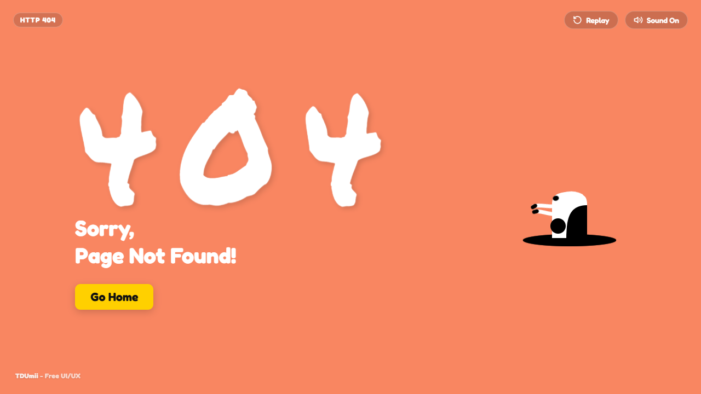
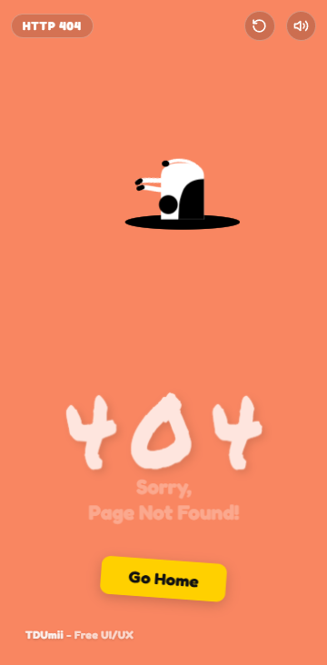

# Cow 404

A playful responsive error-page experience where a cartoon cow walks into a black hole, launches a **Go Home** button, and gets stuck in an animated loop. The interface is built as a self-contained vanilla HTML, CSS, and JavaScript project for the Free UI/UX Gallery.

## Preview





## Highlights

- Multi-stage scene: walking cow, dive into the hole, flying **Go Home** button, error message reveal, and an idle stuck-cow loop.
- Replay control and `R` keyboard shortcut for restarting the complete animation.
- Sound toggle and `M` keyboard shortcut with MP3/WAV audio assets and a Web Audio API fallback.
- Click or focus the stuck cow to trigger faster kicking, tail motion, and a reaction effect.
- Inline SVG character artwork, CSS keyframe animation, and responsive layouts for desktop, tablet, and mobile.
- Semantic sections, skip link, ARIA labels, visible keyboard interaction, and reduced-motion styling.
- No dependencies, package installation, build step, API key, or backend required.

## Run locally

Open `index.html` directly in a modern browser, or start a static web server from inside this folder:

```bash
python -m http.server 8080
```

Then visit [http://localhost:8080/](http://localhost:8080/).

The **Go Home** button is a local demo action that returns to the current site origin. Replace its behavior in `index.html` or `script.js` when integrating the page into a real website.

## Timeline

- `0.0s - 1.8s`: The cow walks from the left edge toward the hole.
- `1.8s - 2.1s`: The cow reaches the hole and dives in.
- `2.1s - 2.7s`: The **Go Home** button pops out, follows a curved path, and lands.
- `2.5s - 2.8s`: The 404 code and recovery message appear.
- `2.8s onward`: The stuck cow loops with kicking legs and a moving tail.

## Project structure

```text
Cow-404/
├── index.html
├── style.css
├── script.js
├── assets/
│   └── audio/
│       ├── moo_appear.mp3 / moo_appear.wav
│       ├── moo_fall.mp3   / moo_fall.wav
│       └── moo_click.mp3  / moo_click.wav
└── README.md
```

## Customize

- Edit the error code and message in `index.html`.
- Update the home destination in the `btnHome` handler in `script.js`.
- Adjust colors, layout, and animation timing in `style.css`.
- Replace the audio files in `assets/audio/` while keeping the existing filenames, or update the `<source>` paths in `index.html`.

## Credits and license

Created by **TDUmii - Free UI/UX**. See the [gallery repository](https://github.com/TDUmii/free-ui-ux-gallery) for the complete collection.

Source code is available under the gallery's [MIT License](../LICENSE). Audio files are included with this project for its interactive demo and retain any applicable source terms.

© 2026 TDUmii - Free UI/UX.
