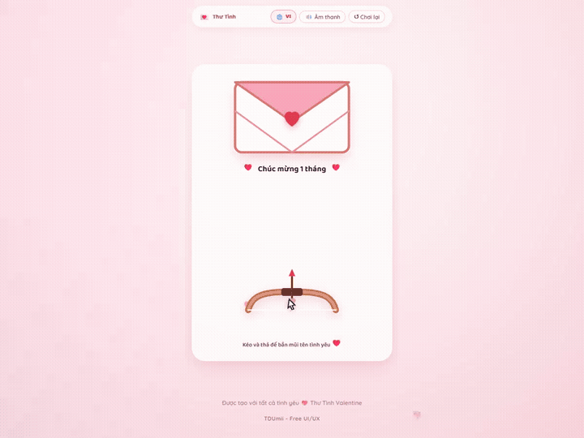
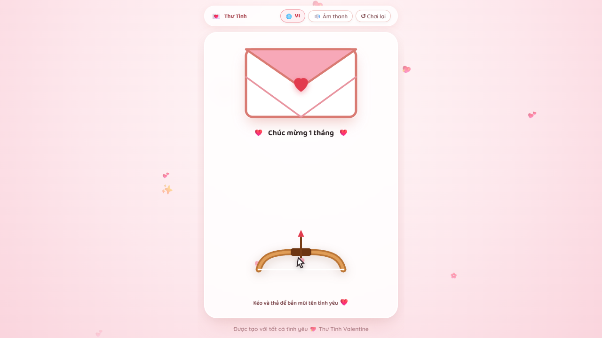
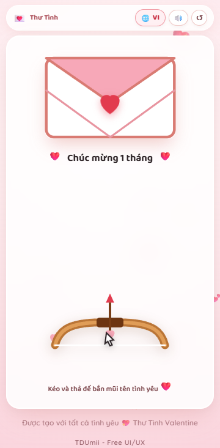

# Love Letter

A romantic Valentine letter experience with a Cupid bow interaction, a pixel-art cat, playful yes/no choices, and a typed love-letter reveal. The project is a self-contained vanilla HTML, CSS, JavaScript, and Canvas interface for the Free UI/UX Gallery.

## Preview



[Watch the WebM recording](docs/demo.webm)






## Highlights

- Drag and release the Cupid bow to send the love arrow toward the envelope.
- Interactive pixel-art cat scene with a playful **No** button and an animated **Yes** response.
- Typed love letter reveal after accepting the message, with a restart action.
- Vietnamese and English copy with the `L` language shortcut.
- Sound toggle with the `M` shortcut and replay control with the `R` shortcut.
- Responsive layout for desktop and mobile, with keyboard-focusable controls.
- No dependencies, package installation, build step, API key, or backend required.

## Run locally

Open `index.html` directly in a modern browser, or start a static web server from inside this folder:

```bash
python -m http.server 8080
```

Then visit [http://localhost:8080/](http://localhost:8080/).

## Project structure

```text
Love/
├── index.html
├── style.css
├── script.js
└── README.md
```

## Customize

- Edit the Vietnamese and English messages in `index.html` and `script.js`.
- Adjust the color palette, pixel styling, layout, and animation timing in `style.css`.
- Update the personal credit link in the footer when adapting the project for another collection.

## Credits and license

Created by **TDUmii - Free UI/UX**. See the [gallery repository](https://github.com/TDUmii/free-ui-ux-gallery) for more projects.

Source code is available under the gallery's [MIT License](../LICENSE).

© 2026 TDUmii - Free UI/UX.
