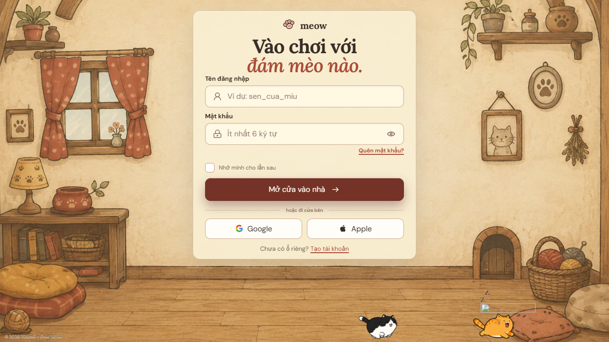
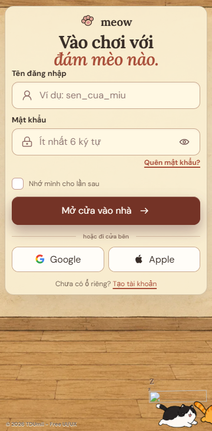

# Meow Login

A one-viewport interactive login page set inside a warm illustrated cat house.

## Preview





## Highlights

- One continuous old-comic room background; the form and cats are no longer split into separate sections.
- The complete interface fits without page scrolling on desktop and mobile.
- Two small transparent eight-frame cats run across the full viewport and turn only after leaving an edge.
- Every animated frame is normalized to one bottom baseline, preventing the cats from jumping vertically.
- A third round cat sleeps quietly on the floor.
- No control or cat interaction plays audio.
- The custom reaching paw appears only on the primary, Google, and Apple buttons. It uses matching foreground and background SVG scenes and visibly overlaps the button edge.
- The password reveal control uses only its eye icon; no cat or paw is attached to it.
- Validation, loading feedback, demo provider actions, keyboard focus, native Edge reveal suppression, reduced motion, and responsive layouts are included.

## Run locally

Open `index.html` directly, or serve the parent directory:

```bash
python -m http.server 4173
```

Then visit `http://localhost:4173/Meow-Login/`.

## Assets

- The cozy room background and generation prompt are documented in `assets/background/ASSET_NOTES.md`.
- Cat generation, alpha handling, frame encoding, and baseline normalization are documented in `assets/game/ASSET_NOTES.md`.
- The supplied stacked-cat illustration was used only as a style and proportion reference.
- The paw interaction follows the two-scene layering technique documented by Hannah Goodridge; attribution is in `assets/interactive/ATTRIBUTION.md`.

## License

Source code is available under the [MIT License](../LICENSE).

© 2026 TDUmii - Free UI/UX.
