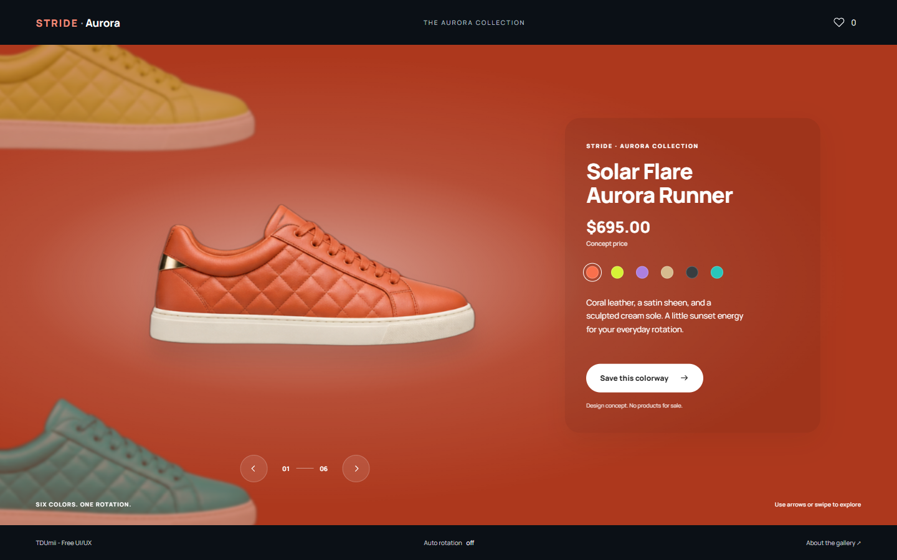

# STRIDE · Aurora Sneaker Wheel

A standalone sneaker colorway explorer inspired by the supplied six-sneaker spinning-wheel reference. Six original product-concept images orbit an off-screen axis while the background, title, description, and selected swatch change together.



## Run

Open `index.html` directly, or serve the gallery root:

```powershell
python -m http.server 4175 --bind 127.0.0.1
```

Then visit [the local demo](http://127.0.0.1:4175/Sneaker-Wheel/). No build step, CDN, package installation, or account is required to run the page.

## Interactions

- Choose any of six color swatches, use the previous/next buttons, or swipe horizontally across the stage.
- With focus inside the stage, use Left/Right to rotate, Home for the first color, and End for the last.
- Save one favorite locally and recall it with the heart button. Storage failures fall back to the current visit.
- Enable optional auto rotation in the footer. Manual navigation, focus entering the stage, and hiding the tab stop it.
- Reduced-motion settings disable animated transitions and hide auto rotation.

The reference's code-editor panels are video presentation material, so the demo focuses on the product stage. Mobile uses the shoe above the product details. The displayed $695 is a reference-inspired concept price; this is not a store. The primary action saves a favorite rather than accepting orders.

## Files

```text
index.html
css/style.css
js/wheel.js
assets/sneakers.png
assets/manrope-latin.woff2
assets/OFL-Manrope.txt
docs/asset-prompt.txt
docs/prepare-assets.py
docs/verify.cjs
```

## Artwork and credits

- Visual reference: the user-provided `Six_sneakers__one_spinning_wheel__built_with_a_little_HTML___CSS___Which_colorway_are_you_copping-_frames` folder. Original reference authorship and license were not supplied. No reference frames are redistributed here.
- `assets/sneakers.png`: original AI-generated, unbranded product concept atlas created with the built-in Imagegen tool. The exact generation prompt is in `docs/asset-prompt.txt` and PNG metadata. The user authorized local background extraction with rembg; the shipping PNG has a real alpha channel. These are illustrations, not photographs of products for sale.
- Manrope by Mikhail Sharanda and contributors, self-hosted under the SIL Open Font License in `assets/OFL-Manrope.txt`. Source: [Google Fonts Manrope](https://github.com/google/fonts/tree/main/ofl/manrope).
- Interface implementation: TDUmii - Free UI/UX. Source code follows the gallery's MIT license. Third-party font licensing remains separate.

## Development checks

`docs/verify.cjs` uses Playwright and a running local server for the full six-color loop, swatches, favorite persistence, keyboard navigation, synthetic swipe events, 390px/320px layouts, reduced motion, and resource/runtime errors. Set `PLAYWRIGHT_MODULE` to the installed Playwright module path if it is not resolvable locally. Asset preparation is a one-time developer utility and is not required by visitors.
