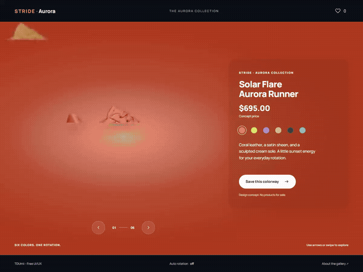
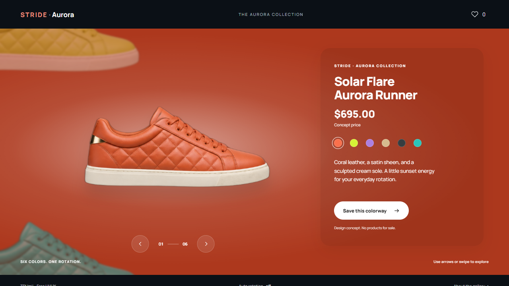
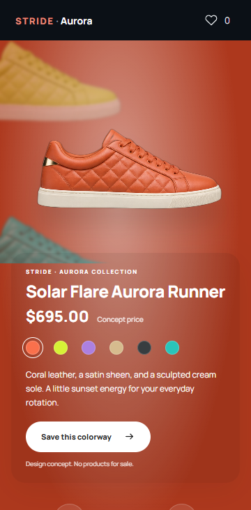

# STRIDE · Aurora Sneaker Wheel

A responsive sneaker colorway explorer built with plain HTML, CSS, and JavaScript. Six sneaker illustrations rotate around an off-screen axis while the background, product name, description, and selected color update together.

## Preview



[Watch the WebM recording](docs/demo.webm)






## Run locally

Download the `Sneaker-Wheel` folder and open `index.html` in a modern browser. Keep the folder structure intact so the stylesheet, script, images, and font can load.

For an optional local server, open a terminal **inside the `Sneaker-Wheel` folder** and run:

```sh
python -m http.server 4175 --bind 127.0.0.1
```

Then open [http://127.0.0.1:4175/](http://127.0.0.1:4175/).

Python is only needed for this optional server. The website requires no installation, build step, API keys, or backend. Images and fonts are included locally.

## Features

- Six colorways with coordinated wheel and background transitions.
- Direct color selection, previous/next buttons, and horizontal swipe navigation.
- Keyboard controls within the showcase: Left/Right to rotate, Home for the first color, and End for the last.
- One saved favorite using browser local storage, with a visit-only fallback when storage is unavailable.
- Optional auto rotation. Manual navigation, focus entering the showcase, or hiding the tab stops it.
- Responsive desktop and mobile layouts, visible keyboard focus, and reduced-motion support.
- A custom SVG favicon.

This is a product design demo. The displayed $695 price is illustrative, and the main button saves a colorway. There is no checkout or payment processing.

## Project structure

```text
Sneaker-Wheel/
├── index.html
├── README.md
├── LICENSE
├── .gitignore
├── css/
│   └── style.css
├── js/
│   └── wheel.js
└── assets/
    ├── favicon.svg
    ├── sneakers.png
    ├── manrope-latin.woff2
    └── OFL-Manrope.txt
```

`.gitignore` keeps local tools and generated verification files out of the repository. It is not required to serve the website.

## Customize

- Edit the six entries in `js/wheel.js` to change colorway names, swatch colors, backgrounds, and descriptions.
- Edit `index.html` for the shared page content and concept price.
- Edit `css/style.css` for typography, layout, and animation timing.
- `assets/sneakers.png` is a transparent atlas arranged in two columns and three rows. Its order is coral, lime, purple, sand, charcoal, and turquoise. Preserve that layout when replacing the artwork, or update the sprite positions in `js/wheel.js`.

Favorites are stored under the `stride-favorite` key in the current browser. They are not synced between devices. Storage can vary when opening the page directly as a local file; the optional HTTP server provides a consistent local origin.

## Credits and license

Created by **TDUmii - Free UI/UX**. See the [gallery repository](https://github.com/TDUmii/free-ui-ux-gallery) for more projects.

- Source code: [MIT License](LICENSE).
- Sneaker artwork: original AI-generated, unbranded product illustrations with transparent backgrounds. These are concept images, not photographs of products offered for sale.
- Manrope font: Mikhail Sharanda and contributors, distributed under the [SIL Open Font License](assets/OFL-Manrope.txt). [Font source](https://github.com/google/fonts/tree/main/ofl/manrope).
