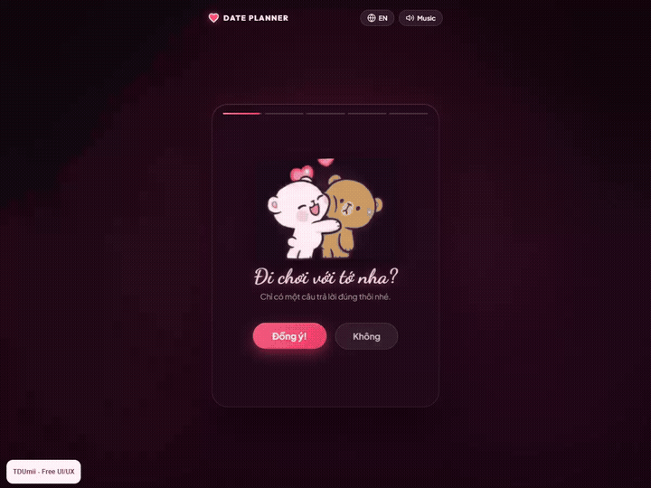

# Valentine Date

A playful five-step date planner with illustrated characters, Vietnamese and English copy, and a personalized date ticket.

## Demo

[Watch the WebM recording](docs/demo.webm)

## Highlights

- Accept the invitation, choose a day and time, then pick an activity and an after-date plan.
- A final ticket summarizes your choices and displays a countdown.
- Calendar options include an ICS download and a Google Calendar link. Adding an event requires your action.
- Language and music controls, animated hearts, and a personal TDUmii signature.

## Run locally

Open `index.html`, or run `python -m http.server 8080` inside this folder and visit http://localhost:8080/. Keep `assets/` alongside the HTML, CSS, JavaScript, and favicon files. Google Fonts requires an internet connection; illustrations and music are bundled locally.

## Customize

Edit messages and date-planning choices in `script.js`, page structure in `index.html`, and colors and layout in `style.css`. This is a browser-based invitation interface, not a booking service.

## Credits

TDUmii - Free UI/UX. Part of the [Free UI/UX Gallery](https://github.com/TDUmii/free-ui-ux-gallery). Source code follows the [gallery MIT license](https://github.com/TDUmii/free-ui-ux-gallery/blob/main/LICENSE). Bundled illustrations and music retain their respective source rights; their original license information was not supplied with this project.
